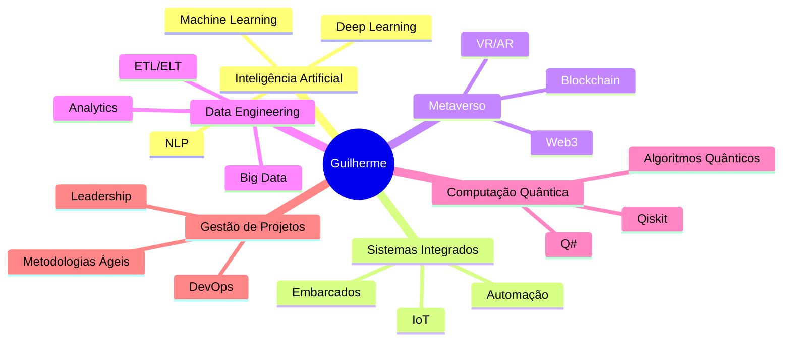

  
# 👋 Olá, mundo! Eu sou **Guilherme Savassa Bernal**

### 🚀 Estudante de Engenharia da Computação | 10º Semestre
### 🏫 **Facens University** - São Paulo, Brasil

 

> 💡 Apaixonado por **Inteligência Artificial**, **Sistemas Integrados**, **Metaverso**, **Engenharia de Dados**, **Computação Quântica** e **Gestão de Projetos de TI**

 

---

## 🛠️ **Stack Tecnológico**

### 💻 **Linguagens de Programação**

  
| Linguagem | Nível | Projetos |
|:---------:|:-----:|:--------:|
|  | **Avançado** | IA/ML, Data Science |
|  | **Avançado** | Frontend, Backend |
|  | **Intermediário** | Apps Escaláveis |
|  | **Intermediário** | Backend, Mobile |
|  | **Intermediário** | Desktop, Web |
|  | **Básico** | Sistemas Embarcados |
|  | **Intermediário** | Computação Quântica |
|  | **Básico** | Sistemas, WebAssembly |
|  | **Básico** | Flutter Apps |
|  | **Básico** | Computação Científica |

### 🚀 **Frameworks & Tecnologias**

#### 🌐 **Desenvolvimento Web**

#### 🖥️ **Desktop & Cross-Platform**

#### 📦 **DevOps & Containerização**

### ☁️ **Bancos de Dados & Cloud**

**Bancos de Dados:**

**Cloud Platforms:**

### ⚛️ **Computação Quântica**

---

## 📊 **Estatísticas do GitHub**

  <picture>
    <source media="(prefers-color-scheme: dark)" srcset="https://github-readme-stats.vercel.app/api?username=Guilherme-Bernal&show_icons=true&theme=tokyonight&include_all_commits=true&count_private=true&hide_border=true&bg_color=0d1117">
    
  </picture>
  <picture>
    <source media="(prefers-color-scheme: dark)" srcset="https://github-readme-stats.vercel.app/api/top-langs/?username=Guilherme-Bernal&layout=compact&langs_count=8&theme=tokyonight&hide_border=true&bg_color=0d1117">
    
  </picture>

  
  

---

## 🎯 **Áreas de Interesse**

---

## 🌐 **Conecte-se Comigo**

---

### ⭐️ **"O futuro pertence àqueles que acreditam na beleza de seus sonhos."**

**🚀 Explore meus repositórios e acompanhe minhas jornadas de aprendizado!**

